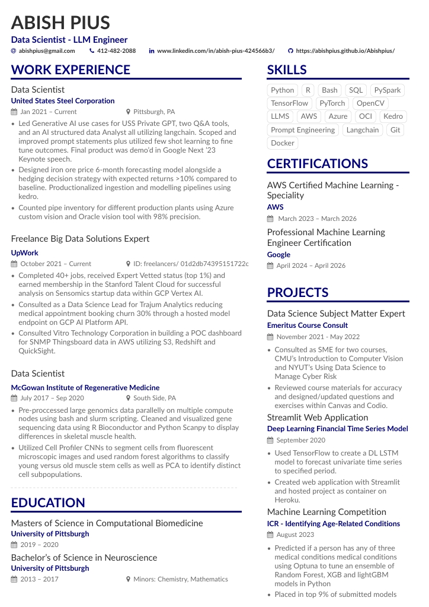

# Abish Pius - Data Scientist & LLM Engineer

## Personal Portfolio Website

## Overview

This repository contains the source code for my professional portfolio website. The website showcases my experience as a Data Scientist and LLM Engineer, highlighting my skills, professional experience, projects, and educational background.

## Features

- **Professional Resume**: Comprehensive overview of my skills, work experience, and education
- **Project Showcase**: Highlights of my key professional projects
- **Skill Visualization**: Interactive skill bars demonstrating proficiency levels
- **Contact Form**: Easy-to-use contact form for professional inquiries
- **Resume Download**: Direct download link to my latest resume
- **Responsive Design**: Fully responsive layout that works on all devices

## Technologies Used

- **Frontend**: React, TypeScript, Tailwind CSS
- **UI Components**: Shadcn UI, Lucide Icons
- **Styling**: CSS animations, custom theme based on Plum Mustangs colors (purple and gold)
- **Form Handling**: React Hook Form with Zod validation
- **Backend**: Express.js for API endpoints
- **State Management**: React Query for data fetching

## About Me

I'm Abish Pius, a Data Scientist and LLM Engineer with expertise in:

### Skills

- **Programming & Data**: Python, R, SQL, PySpark, Bash
- **Machine Learning & AI**: LLMs, TensorFlow, PyTorch, Prompt Engineering, Langchain
- **Cloud & DevOps**: AWS, Azure, OCI, Git, Docker

### Notable Projects

- **USS PrivateGPT Implementation**: Led Generative AI use cases leveraging langchain and customized prompts, demo'd at Google Next'23 Keynote
- **Financial Time Series Model**: Created a deep learning LSTM model for time series forecasting with web application
- **ICR - Identifying Age-Related Conditions**: Built an ensemble ML model placing in the top 9% of competition submissions

### Experience

- **Data Scientist** at United States Steel Corporation (2021-Present)
- **Freelance Big Data Solutions Expert** on UpWork (2021-Present)
- **Data Scientist** at McGowan Institute of Regenerative Medicine (2017-2020)

### Education

- **Masters of Science** in Computational Biomedicine from University of Pittsburgh (2019-2020)
- **Bachelor's of Science** in Neuroscience from University of Pittsburgh (2013-2017)

## Connect With Me

- **Email**: [abishpius@gmail.com](mailto:abishpius@gmail.com)
- **Phone**: [412-482-2088](tel:4124822088)
- **LinkedIn**: [www.linkedin.com/in/abish-pius-424566b3/](https://www.linkedin.com/in/abish-pius-424566b3/)
- **Website**: [abishpius.github.io/Abishpius/](https://abishpius.github.io/Abishpius/)

## License

This project is licensed under the MIT License - see the [LICENSE](LICENSE) file for details.